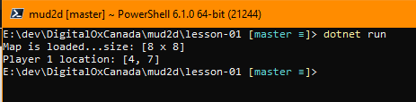

# Lesson Notes
This lesson covered the basics of getting started with a new project.

1. Using the command line to start a new console application.
    > dotnet new console -o MyApp

2. Creating and editing the readme.md.  The .md extension is for markdown files and the example syntax is shown below.

3. Understanding using, namespace, static main.

4. Building an inline map into an array and parsing the map.

# Q&A
**Q**: How does `int MapXSize = mapLines[0].Length;` work?  
**A**: mapLines is an array, so mapLines.Length is the size of the array, the number of lines essentially.  mapLines[0].Length is the length of the first line in the array, array element 0, so that tells me how long the string is giving me a width.

  
  
  
---
below was content used to teach the syntax of markdown (.md)
# Heading 1
This is similar to html H1

## Heading 2
This is similar to html H2

### Heading 3
Test

---
test

This is our *first* project. **woohoo**.
