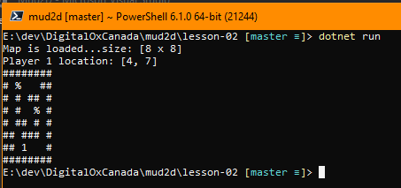

# Lesson Notes

1. Create map in a file and make build process copy map to output folder in the project file.
```html
<ItemGroup>
 <None Update="maps\map1.txt">
  <CopyToOutputDirectory>Always</CopyToOutputDirectory>
 </None>
</ItemGroup>
```  

2. Read a map from a text file instead of inline.
   
3. Faster method to find where the player is located on the map.

4. Output the map to the screen.




# Q&A
**Q** Why switch from `string[] mapLines = {
"########", ...` to reading from a file?  Why not just read from a file to begin with?  
**A** I find when prototyping a solution starting with the simplest approach of inline code can solve the initial problem.  Moving to a file may also not be the end result as it could be from a database or webservice in the cloud.  

**Q** I don't fully understand why this line  `int foundp1 = currentLine.IndexOf('1');`  
**A** instead of looping char by char through the string testing each char to see if the char was '1' I used a string method called IndexOf( ).  You should review existing methods in the C# language on the MSDN site. [MSDN](https://docs.microsoft.com/en-us/dotnet/api/system.string.indexof?redirectedfrom=MSDN&view=netframework-4.7.2#System_String_IndexOf_System_String_)  

**Q** This is new to me `static private MapSettings mapsettings = new MapSettings();`  
**A** 