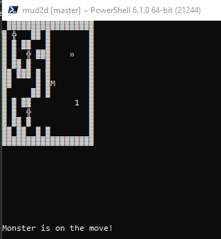

# Lesson Notes

1. Added logging using [Serilog](https://serilog.net/) my favourite .Net logging.  

2. Added the start of having Stairs.  A single `MapTileStairs` with a direction instead of separate classes.

3. Rewrote Gameloop to call `TheMap.Update()` instead of Draw and handle user input.

4. Changed user input to detect if a key is available to grab, otherwise keep looping.  This now allows the game to loop without waiting for the user to press a key.

5. Updated Monster, Player, Map with `Update()` and detects if redrawing of any elements are needed before redrawing.  This prevents constant flicker of redrawing every loop.

6. Updated some ascii char representations.  https://theasciicode.com.ar/american-standard-code-information-interchange/ascii-codes-table.png

7. Added Class Diagram to show visual representation of classes.

